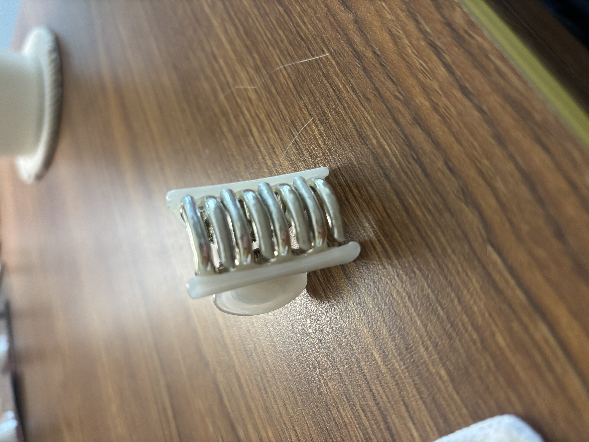
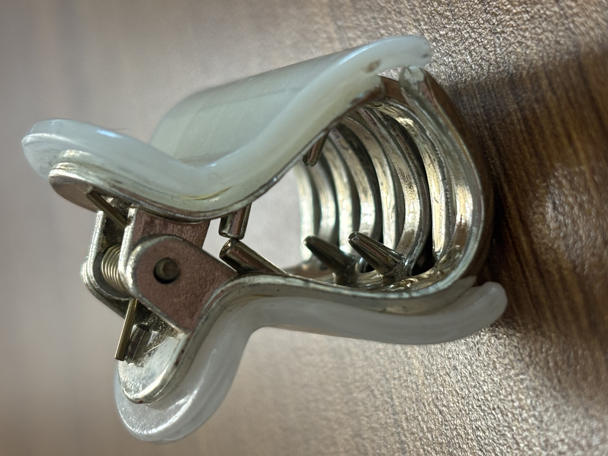
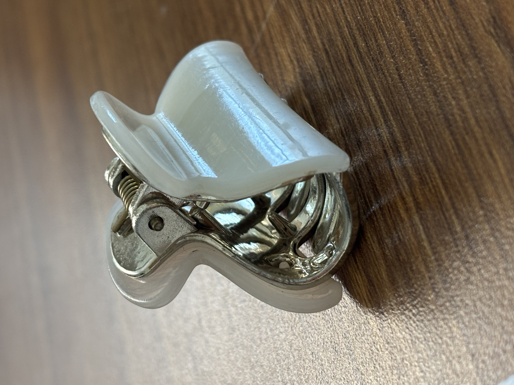

## A1 – Building Your Professional Portfolio

## Objective
To build a professional portfolio.

## Analyze
### Task A - Analyzing Portfolios 
**Portfolio #1** - https://instructure.charlotte.edu/eportfolios/4239/home/about-me
**A. Navigability: **As a reader, yes I can navigate any assignment in 60 seconds or less. 
**B. Reproducibility: ** Yes. I decided to look at Assignment 5: Bracket Design. Devin was clear on his knowns, assumptions and descriptions of each part during the analysis of each component of his design. He also gave multi-view drawings with specific dimensions. 
**C. Evidence of Reasoning:** Yes, the given portfolio shows how decisions were made. He gave his clear unknown and using what he does know he found, an example would be the Stress and Stiffness analysis. He used his calculated information is very strategic steps building off the previous one to get a conclusion. 
**D. Professional Tone:** Yes, I would consider this a professional tone. 

**Portfolio #2** - https://github.com/vsmidhun21/portfolio
**A. Navigability:** Initially once I visited Midhunds GitHub site it took me some time to find his portfolio. Once I found it I could easily navigate his projects and contact information as it was in very bold letters at the top. 
**B. Reproducibility:** Although this engineer has projects listed, they are a very brief description (as in a sentence) about what he created. This is not enough information for someone to repeat this project. 
**C. Evidence of Reasoning:** This portfolio does not show much of anything, except contact information. He does have a resume attached but that is another link to toggle and read through. Which is not very time efficient or a desirable feature. 
**D. Professional Tone:** This person does use very professional language, but all the sections of commentary are very brief throughout the site. 

### Task B - Product Analysis
https://patents.google.com/patent/US20040226574A1/en. 

**A.**  The Claw clip is a simple yet complex design that involves two separate pieces of plastic with teeth on the end, combined by a hinged spring. This design allows for either your hair or two pieces of material to be clamped together with such force that they do not separate from one another. This simple, small clip from Amazon, which is not the same company as the patent, yet enforces the same physical principles for this object.

**B.** i) Applying Hooke's Law for torsional springs which creates a gripping force to hold the hair in place. Using F=-kx, F is acting as the pinching force on the two outer wings of the clip to open it. K is the classic spring constant, and x is the displacement of the angle of the jaws when you apply the pinching force.  
ii) It would be assumed you have a present amount of force with the spring when opening the clip. 

**c.)** Take Photographs of each component and describe precisely how the geometry affects the mechanical function. 

These are the claws at the end of the clip. These function as a clasp for your hair. The rounded and rather skinny design of these prongs allow you to grab hair without the hair slipping out. This will distribute the hold evenly. 

This is a look of the main mechanism of the clip. Here you can see the hinged spring and where it lives relative to the clip. On each side are pieces of molded polymer. The two prongs sticking on relative to the top of the spring are glued onto those pieces of polymer allowing for the force applied to the top ends of the polymer pieces without any breakage. 

Here is a relative view of the additional polymer pieces glued to the original ones. Since this clip is so small is size there is extra support allowing for the clip to be able to open with the size of a finger. This additional piece also allows for personalization designs from the manufacturer. 

**D.)** The patent number for this design is US20040226574A1, and the credited inventors for this product are Jason Winn and Travis Winn. i.) Two different alternative solutions for this hair clip can be: A) A piece of string. This string will allow you to tie your hair up. and b) A classic ponytail holder. Along with the string, these both give the same overall goal of getting your hair up and out of your face or off your neck. ii.) One specific design the engineer made was gluing two separate pieces of plastic together on top of the previously made clip to allow for decoration. I assume they made this choice based on customer demand and better sales forecasting, also making the pinching area thicker to allow for more grip using your fingers to pry the two pieces apart. 

## Decide
**1. Homepage Identity:** When visiting my homepage, a reader needs to immediately understand who this professional portfolio belongs to, and what the contents are about mechanical engineering assignments for MEGR 2157. 

**2. One Intentional Customization:** The one I am identifying is the assignment section. I would like to not only keep the "A01" part but also add the assignment name. This will help my sight visitors be able to quickly identify each assignment and the contents. To do this I accessed the VS Code for the file and directly went in and changed the names. 

**3. Your Documentation Standard:** For this portfolio I am not only committing myself but my readers as well, a clear and professional tone when explaining decisions and processes. I will also commit to providing enough information to understand the content.
   
## Communicate
This section of the assignment is completed on my "About me" section of my portfolio. 

