# A2 - Design with Basic Stresses

## Objectives
**-** Design a lightweight planar truss using A500 steel or an alternative material.
**-** Create free body diagrams (FBDs) for joints and critical pins.
**-** Calculate the required cross-sectional area of truss elements with a safety factor.
**-** Determine pin sizes based on shear forces with a safety factor.
**-** Solve equations symbolically and numerically for both truss and pin design.
**-** Estimate the total weight of the truss and pins.
**-** Create a CAD model with accurate dimensions and connections.
**-** Compare CAD weight predictions with hand calculations.
**-** Document key engineering lessons learned from the process.

For this assingment I was tasked with designig and 3D modelig a truss given specific parameters. 

## 2. Designing Overall Truss Geometry
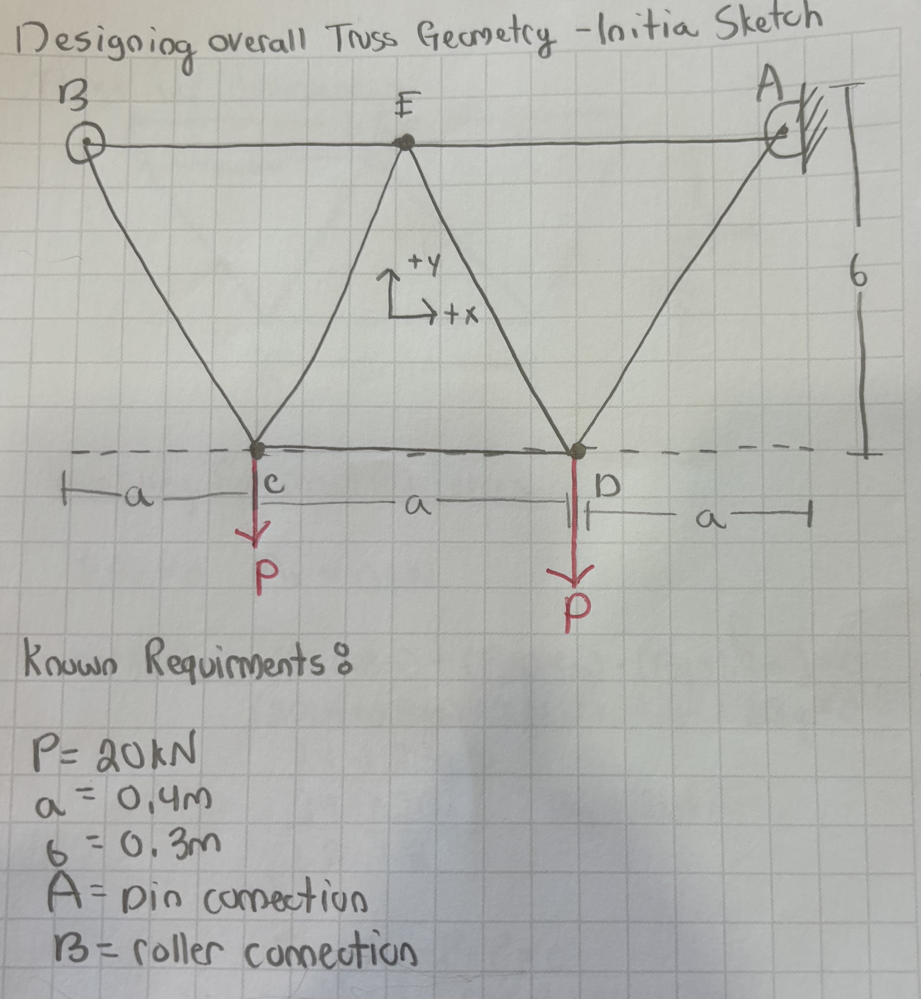
### a. 
**i.)** When I first read through the assigment paramters. I drew out the given template on a sheet of paper. From there I started sketching a truss. I drew the first thing that came to find. Note that this was done without any research and just from imagination. When you sketch a design it is always imperative to label your axis. This is important because you can relativly change them whenever you would like. I wrote down all of the known requirments of the truss as well. I wrote down all of the lengths of each section. My next natural step to take was solving for the reaction forces for the external points. These are done using the 2 equlibrium equations we learned in statics. After these reaction forces were solved. 
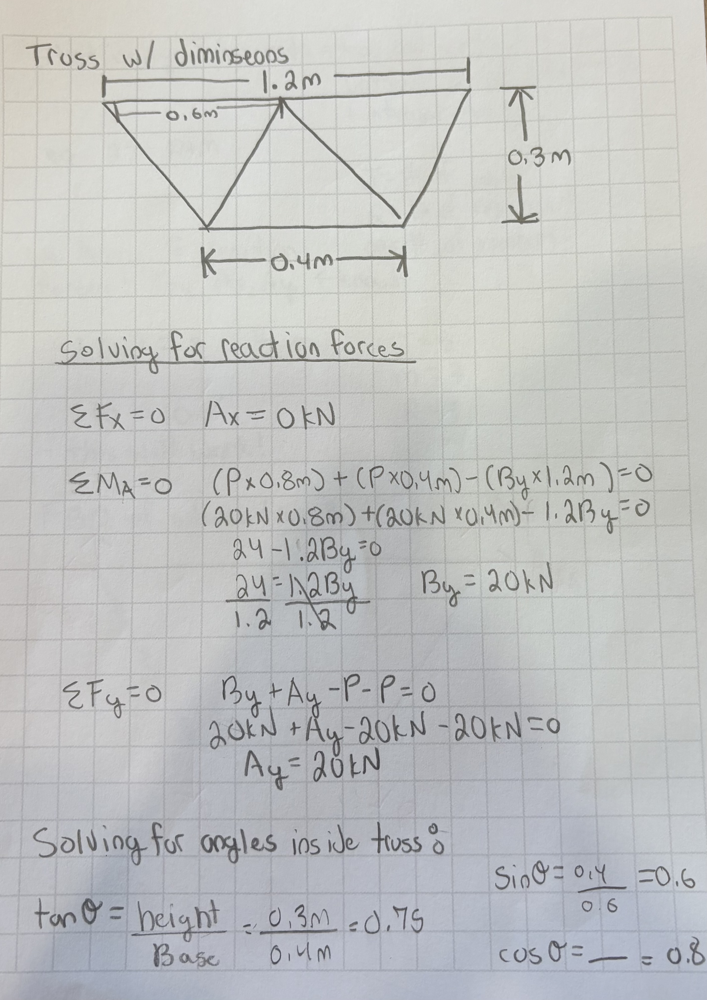
After these forces and angles were solved for, I remembered a key step in trusses. Although this could be a step in backtracking, it is always good to take a moment and go back to apply what you have learned. I used the statically determinte formula. 2J=R+M. Having a truss that is statically determiate for this assignment is so important in the way that you will be able to solve for your uknowns reactions and internal memebers! This equation is defined a J = # of joints, M = # of members, and R = # of unknown reactions. Once I saw both sides were equal to each other I knew I was good to go foward with my designing. 

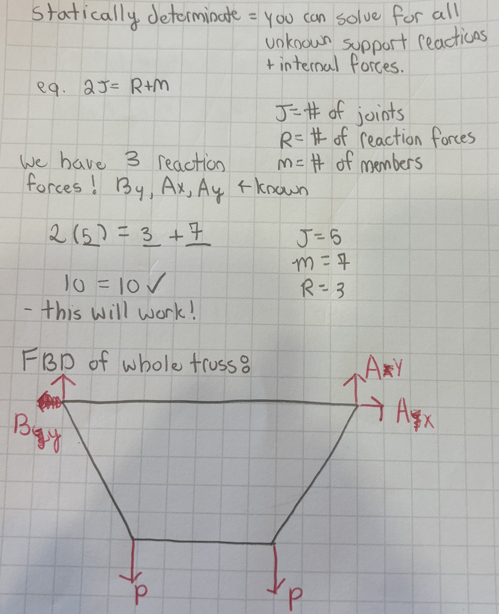

**ii.)** I broke the entire truss down into each joint, also known as method of joints. From there I realized I had some missing sin,tan,cos angles that I needed to find to help me determine all of my internal forces. I would like to make a strong note that I ASSUMED the direction (either tensile or compression) in my FBD's. When calculating my equilibrium equations, If the number comes out negative it is assumed to be the oposite way than you drew it. I also solved for the lenght of each of my internal members. 
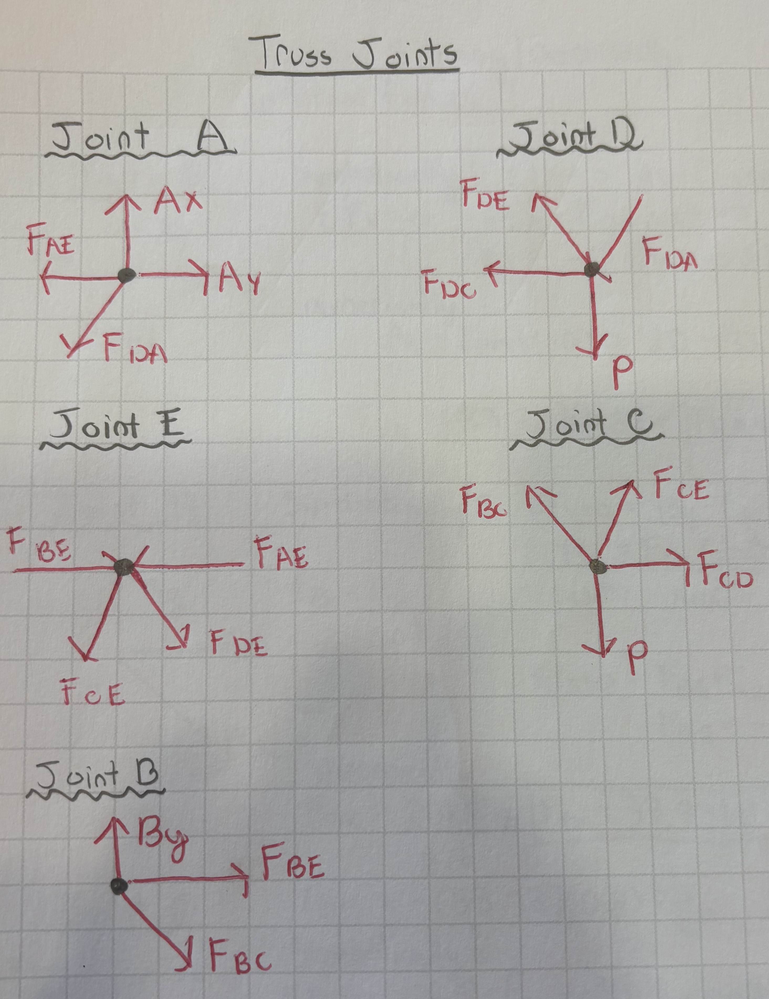

**iii.)*** Shown below are my calculations for each internal member solved symbolically. This is extreamly import to where if you do make a mistake you can trace your work back. Often times in engineering numbers are always chaning, but the principal remains in contact! 
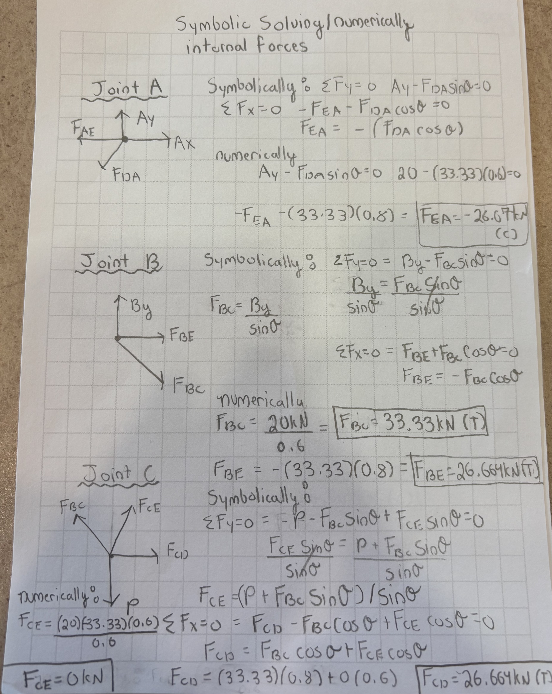
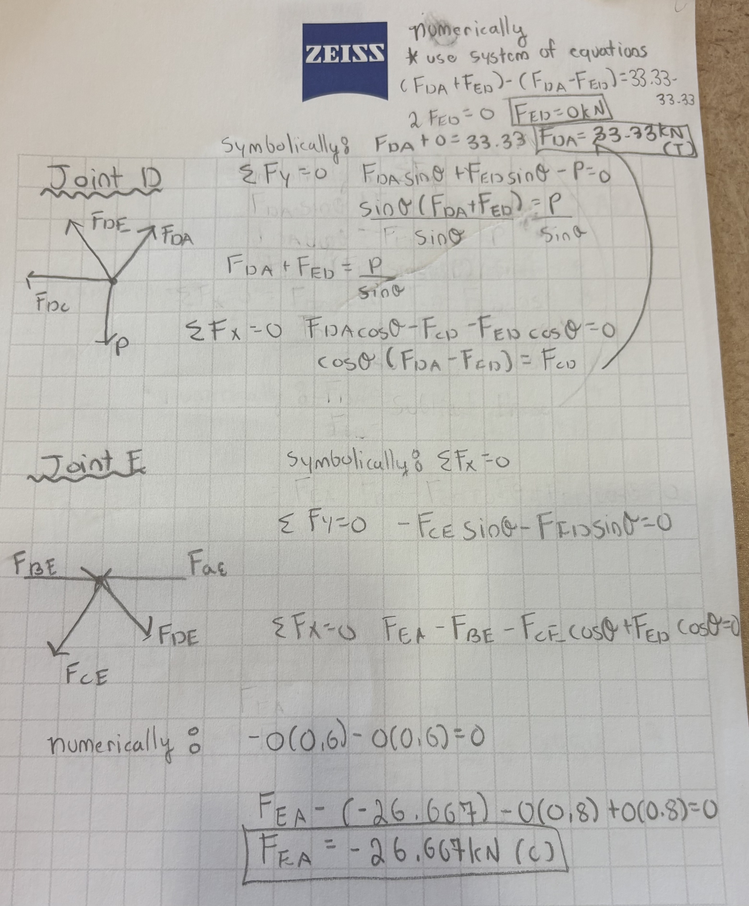
**iv.)** In the same image above, I also calculated the numerical forces. Doing this along side my symbolic work ensured that I could trace my steps back, and that I could also work side by side my principals. 

### B. 
**i.)** 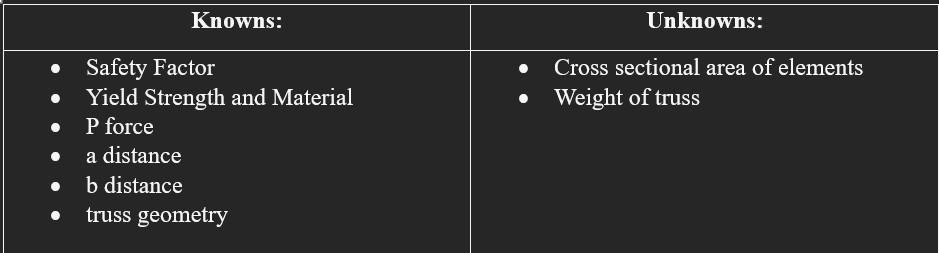

**ii.)** 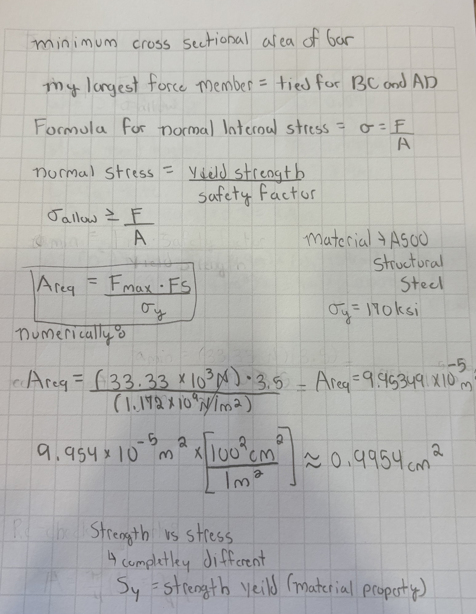
Calculating the minimum cross sectional area of the bars is important to to define safe boundarys. The formula being used is Areq = (Fmax x Safety Factor)/yield shear strenght. For this part I was provided with the Safety Factor of 3.5 and the yield shear strenght of a hardened tool steel at 170ksi with a density of 0.278 lb/cu in. To help determine my Fmax, I can look back upon solved forces in method of joints. I have two joints with a max load of 33.33 kN. These two joints will share the maximum load of the truss. Once I got my calculations, I converted my units to cm to allow for better CAD dimensions. My Areq came out to be 0.9954cc.

**iii.)*** This documentation can be found in the image directly above. 
**iv.)** 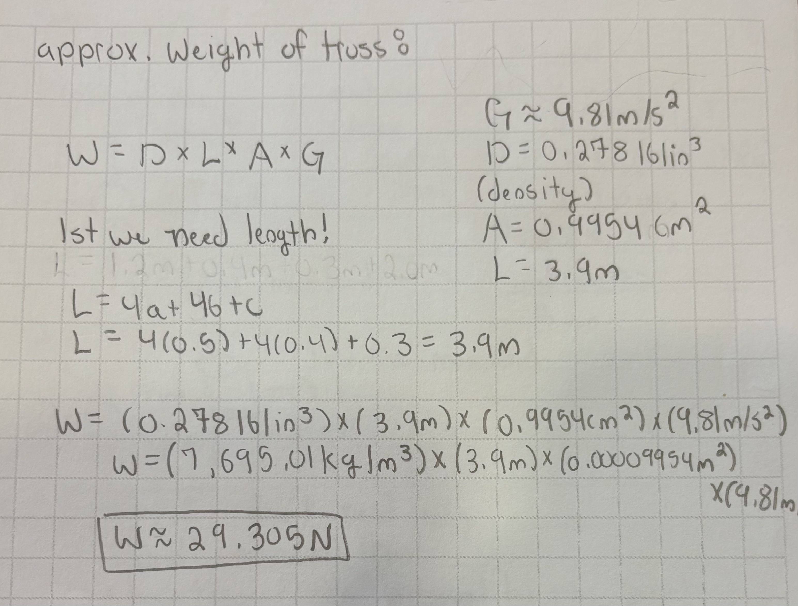
For the weight of the truss I used the formula W = DxLxAxG. Where G = 9.81m/s^2, D = 0.278ln/cu in., A = 0.9954 cc, and all I was missing was L! For the lenght I used the formula L=4a+4b+c. My length came out to be 3.9m. Once I had all of these values I decided to convert all units to correlate to meters. From there I plugged them in and got W=29.305N. 

## 3. Pin Work
### A.
**i.)**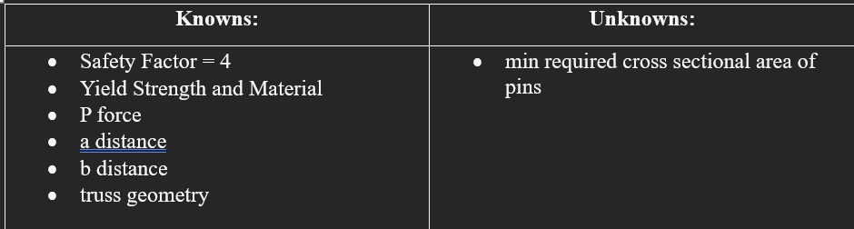
Here I listed all of my knowns and unknowns for this section!

**ii.)** 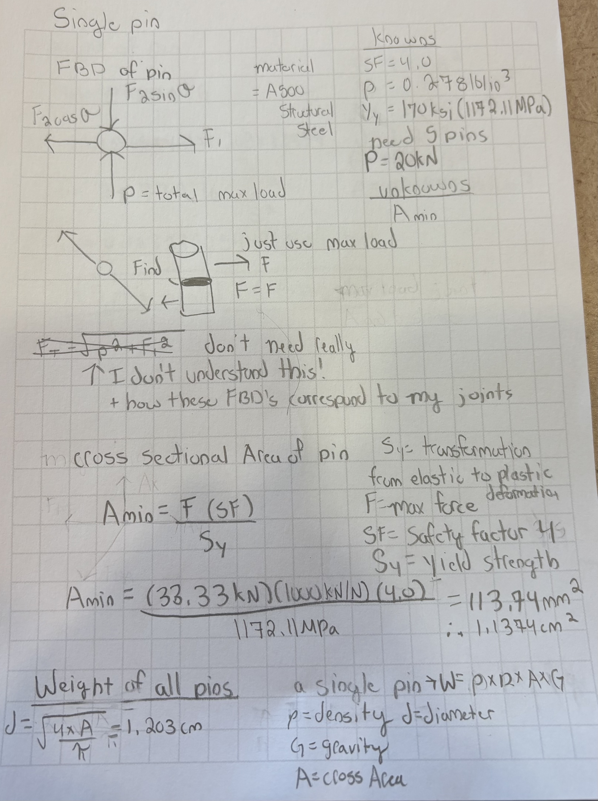
I drew an FBD of my largest reaction load. This was A and B. Since they were the same I only drew one. I used the FBD template provided with this assignment. Since I am currently taking Mechanics of Materials (Solids) at the same time as this class, I am still fairly new to these concepts. I took time to attend Dr. Fagan's office hours to get more clarification on single shear pins. 

**iii.) and iv.)** 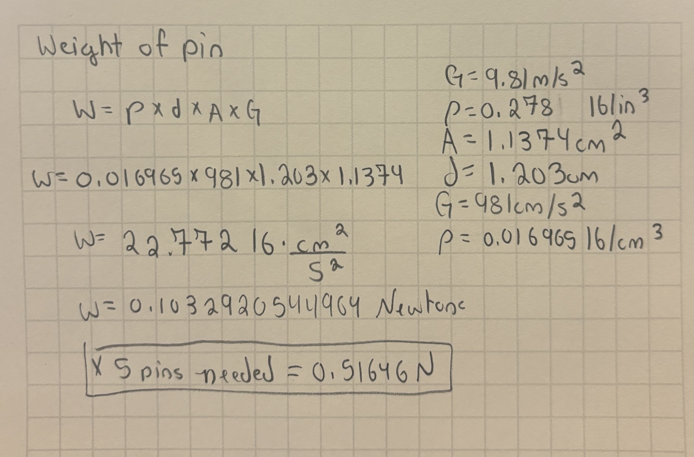
For the minimum cross sectional area of the pins I used the formula Amin = (Fmax x safety factor)/Yield strenght. NOTE: The safety factor for the pins are 4! From there I plugged in all of my values and got 113.74 mm^2. I then converted this to 1.1374 cm^2. 

**v.)** For the weight of pins I used the formula W = PxDxAxG. Where as G = 981cm/s^2, P = 0.016965 lb/cc, A = 1.1374 cc. From here I needed to quickly solve for the diameter associated with the area I found. I used the formula in the picutre and got D = 1.203cm. From here I plugged all of these numbers into the formula and got 0.1032920544964 N. I multiplied this by 5 because I have 5 pins! From there I got the weight of all my pins is equal to 0.51646N. 

# 4. 
### A. 
here is my truss minus the pins!
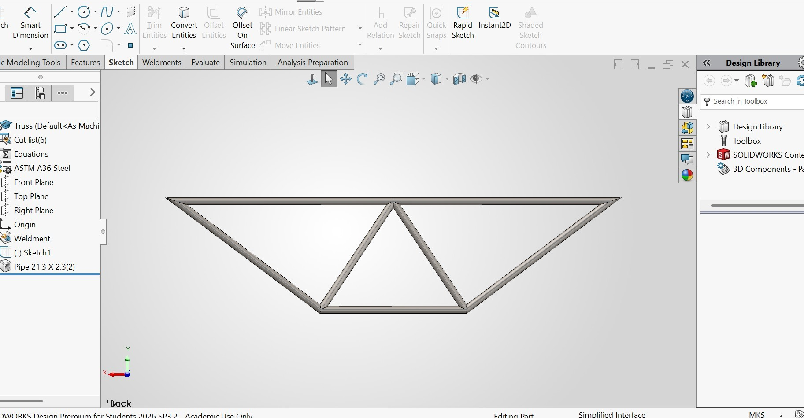

