# A3 – Parametric and FEA

## Objectives: 
Objectives:
-Use axial deflection modeling to design its dimensions
-Use parametric design to determine the bars length
-Introduce you to FEA (Finite Element Analysis)
-Introduce you to linking dimensions to appropriate parameters in CAD.
-Compare and contrast the different analysis

### Part 1 - Beam Design 
**a.)& b.)** For the initial workflow for this assignment, I wrote down the certain parameters given to me and as well as my unknowns so I could see my playing field! 
I decided to choose 3oolbf for my force value, and o.25 for my diameter value. Using the direct tension elongation equation from the Machinery’s handbook from the class, I calculated my required length for my beam. My Youngs Modulus value came from the additional Mat Web material Property data link given to us on this assignment. 
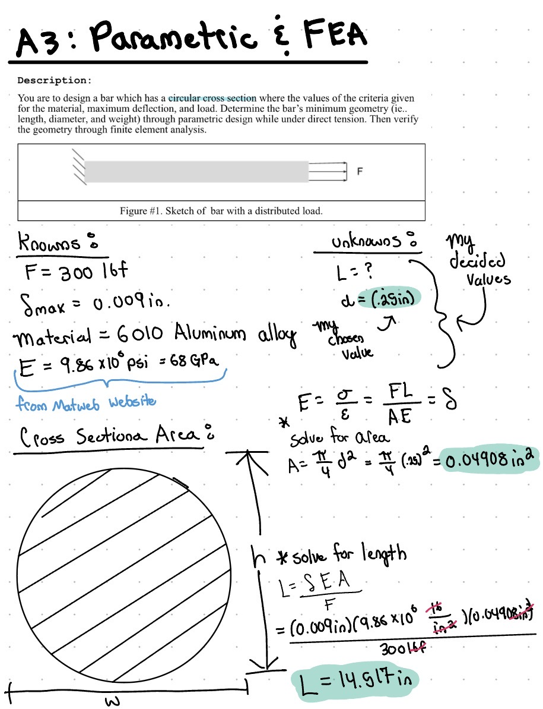

I opened the equations tab in solid works on the left-hand bar tab and inserted all of my values. 
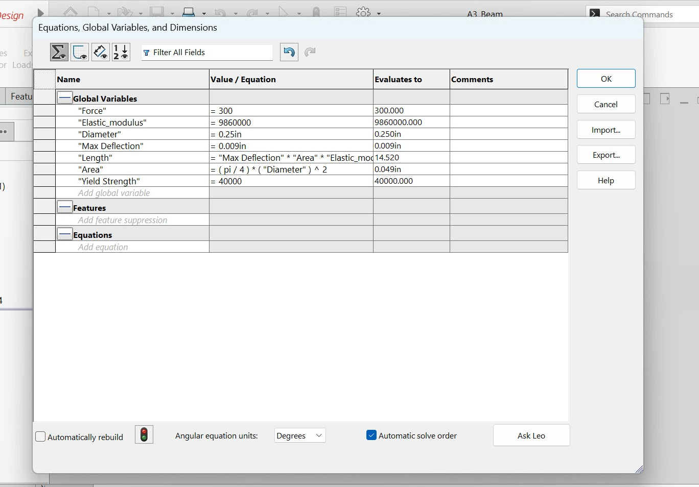

**C.)** Once all my equation values were completed, I sketched a simple circle. I toggled on smart dimensions and when it was time to enter the dimension I wanted, I pressed the equal (=) sign on my computer and assigned the value to my diameter value from my equation sheet. I know that my dimension comes from the equation sheet by seeing the summation symbol beside the value! 
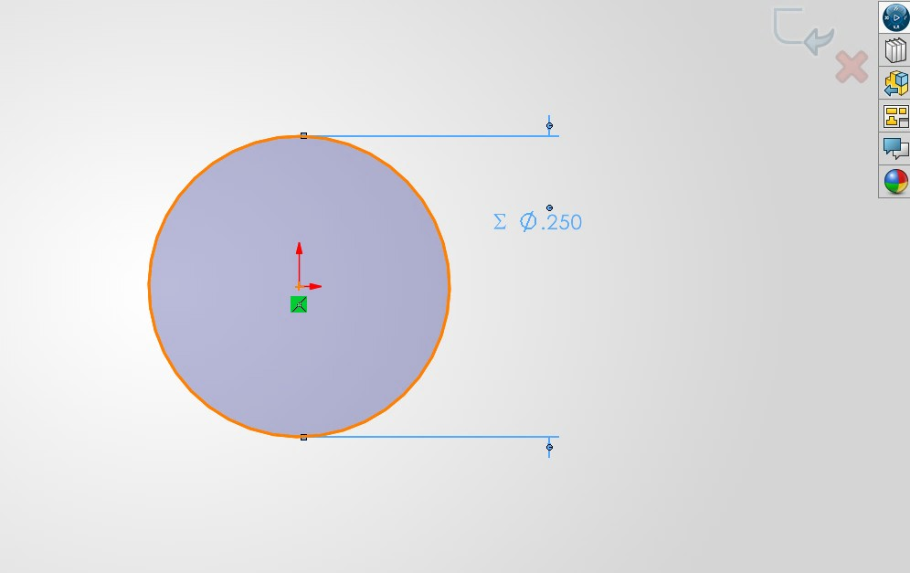

From there I did an extrusion, and same as the dimensions go, I set my extrusion length to be the calculated length from my equation list. 
**Note** - putting all your individual values in and then writing simple code to compute the formula makes this task easier in the sense of going in and changing values. That way if you want to change something all you must change is that one value and it will do the computation for you. 
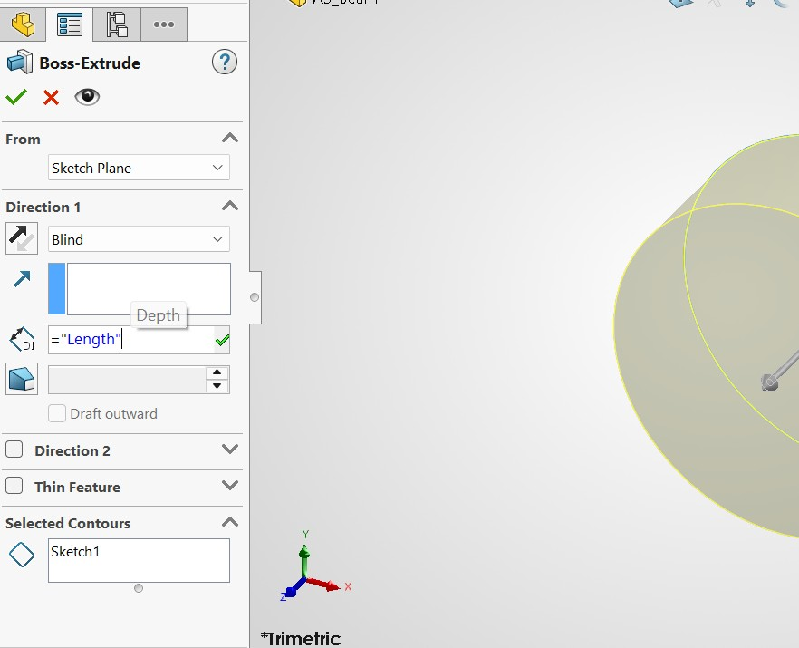

## Material
For the material, I took the aluminum data sheet provided in the assignment and inserted those parameters into Solid Works as a new material. This was my calculations will line up with my FEA. 
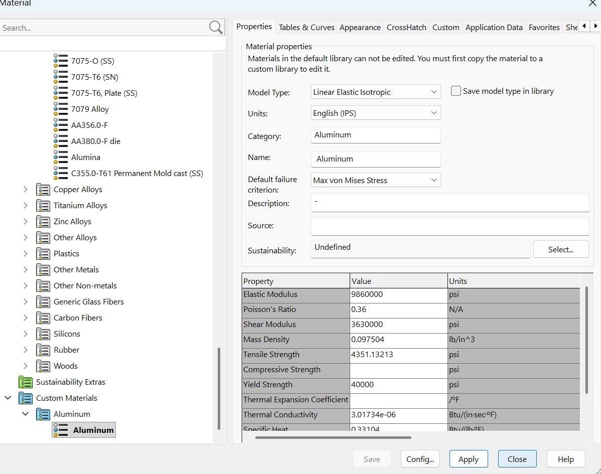
## Part 2 - FEA Analysis

From there I noted that from my parameters list given that one of the sides of the bar must be fixed, so I added a fixed position in Solid Works. From there, I added my force on the other side, making sure that the force was pointing in the right direction is imperative to this assignment. 

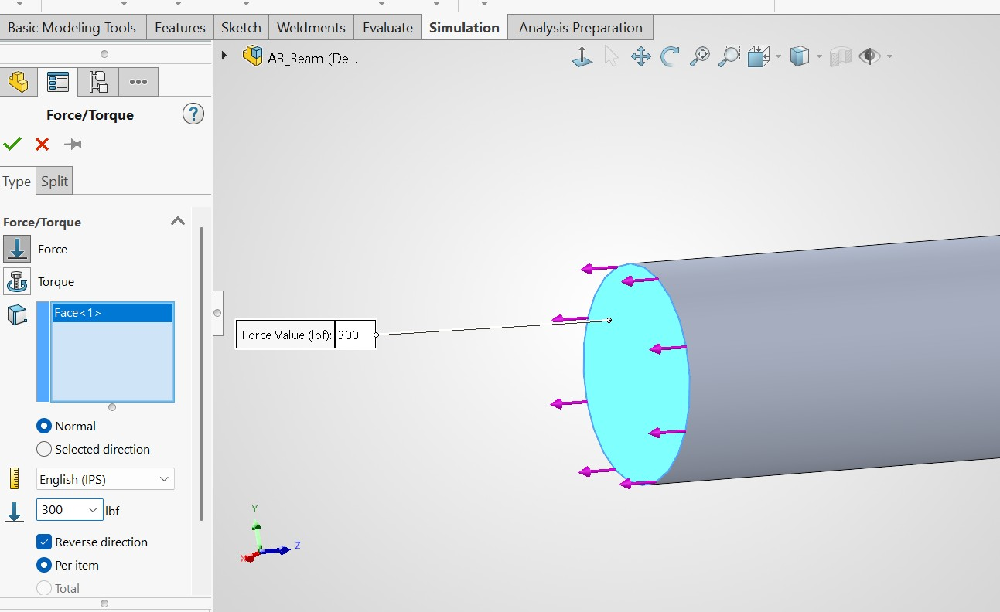

Once my fixed position was set and my force was applied, I made a mesh of my beam. 
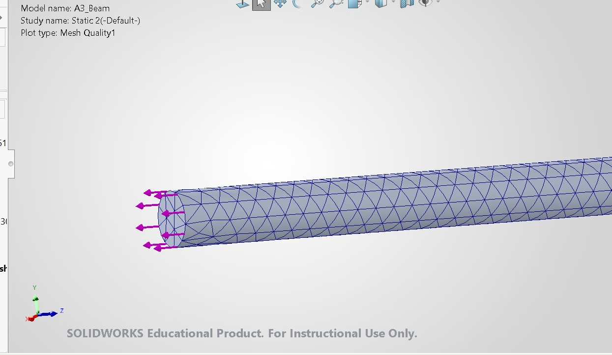
Once the mesh was generated, I could press run and run my simulation. 
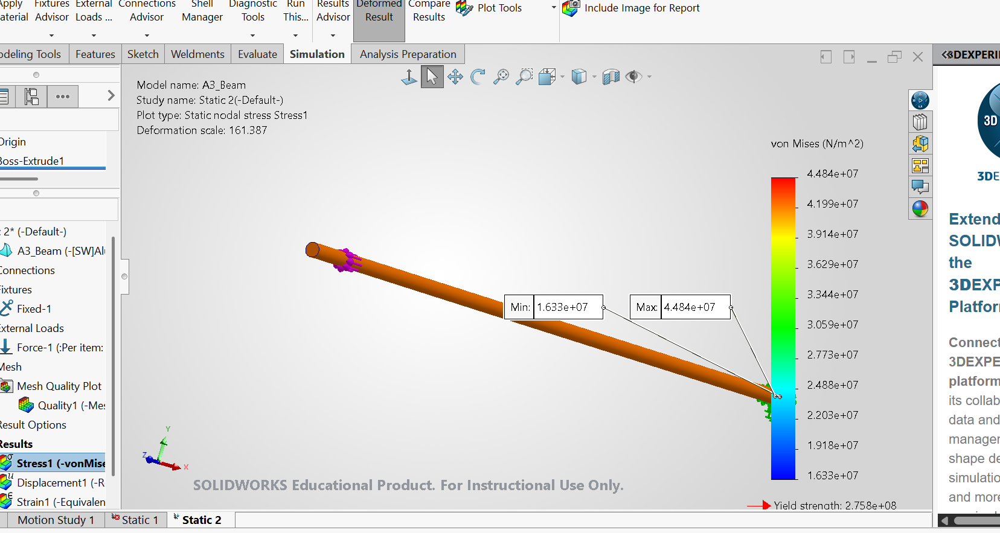
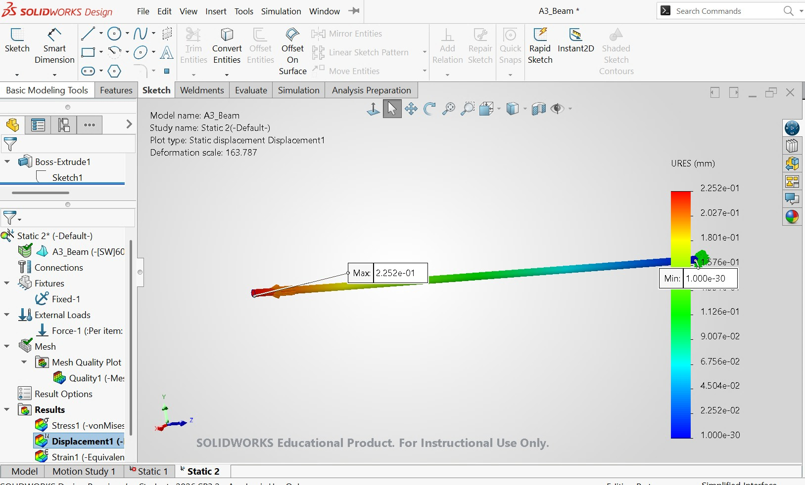

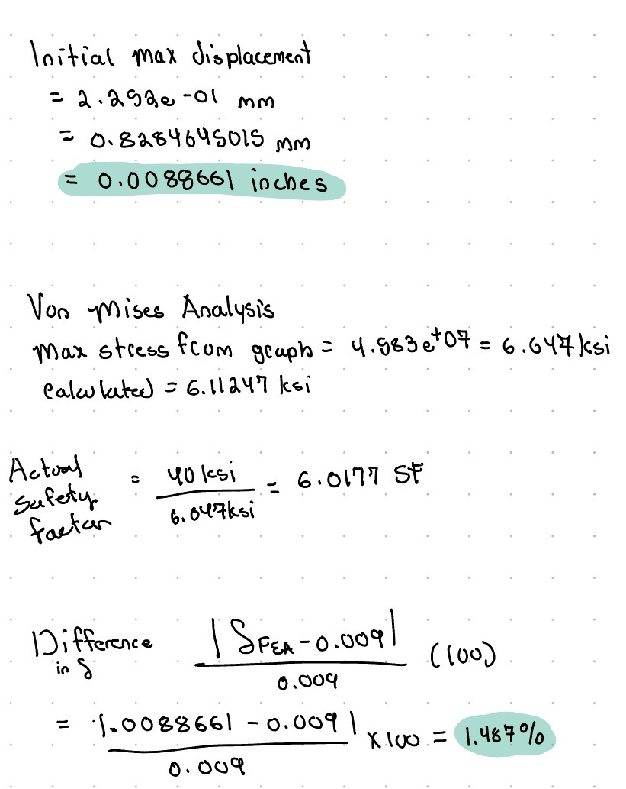
I calculated my max stress allowed as well as my safety factor based on calculated values and graph values from the FEA. 

## 3. Design Reflection
### A. My axial deflection ended up right on the tolerance edge for the assignment, which is okay! 
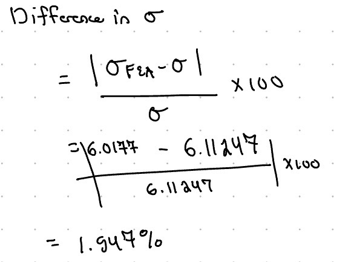

**i.)** There is not a absolute huge meaningful discrepancy, yet I still would like to point it out. My theoretical calculations are larger than my values for the FEA analysis and I think I would like it to stay there. 
**ii.)** Although my calculated values and FEA values are extremely similar, I think they are agreeing over the fact that I imputed the exact material properties. If I was to use a similar material the calculations would be off, yet still applying the same principles.
**iii.)*** I trust my hand calculated values more than Solid Works. Although I am a young engineer, software can always have hidden problems. I'm not exactly sure when this version of solid works was released. 
### B.
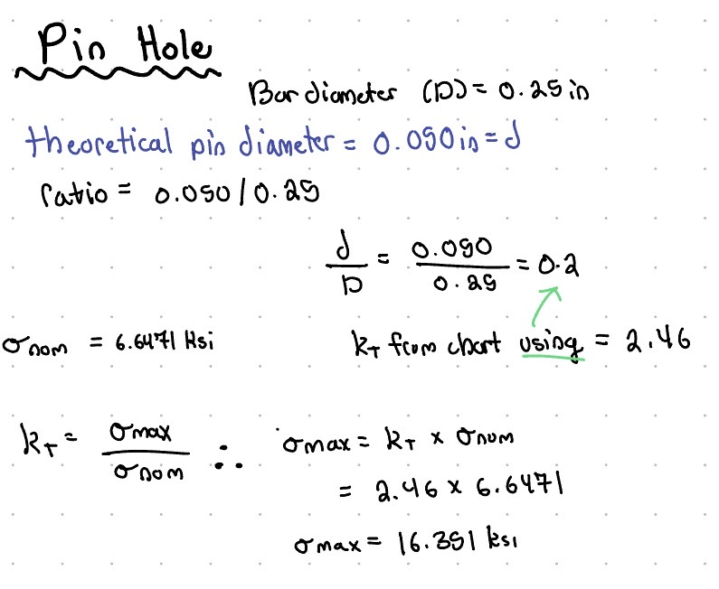

## My CAD File:
[A3_Beam](A3_Beam.SLDPRT)

## 2157 Students Only - Modify Design Parameters 
When tasked to modify parameters I instincivly increased all of my values since I was already at the tolerance limit for the force, and my diameter was pretty small. Ofcource since I increased these parameters, my length overall increased, drastically too. 
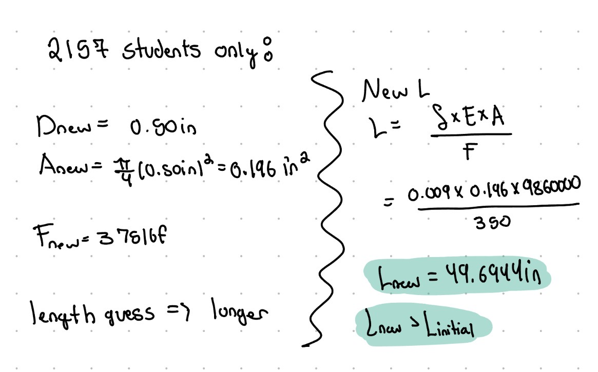
This assignment took me ~4 hours

