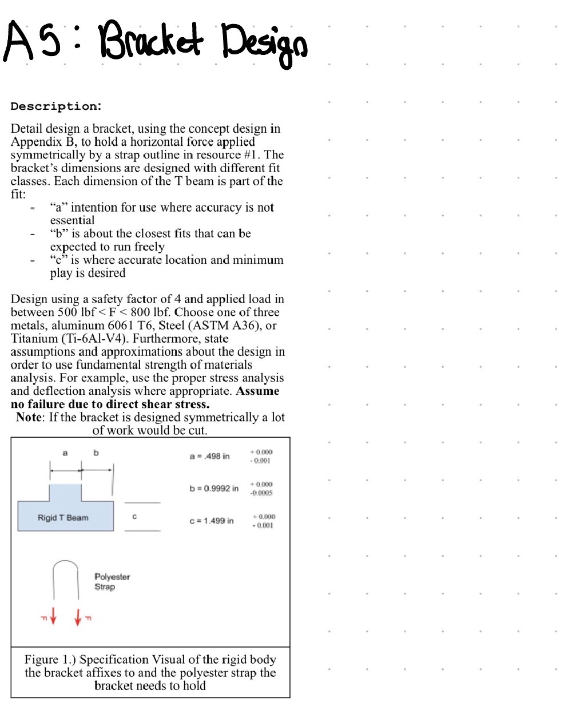
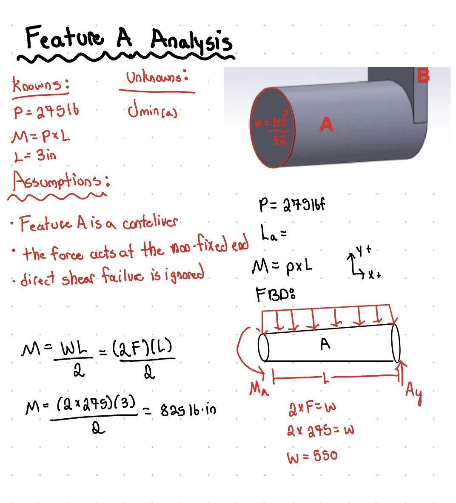
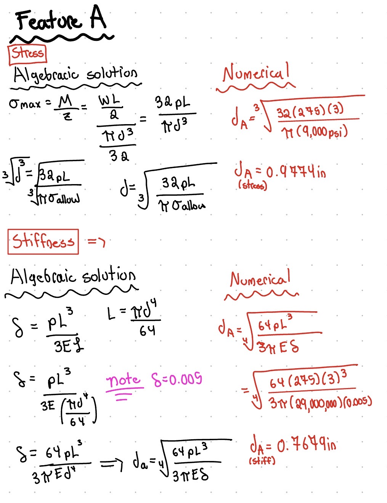
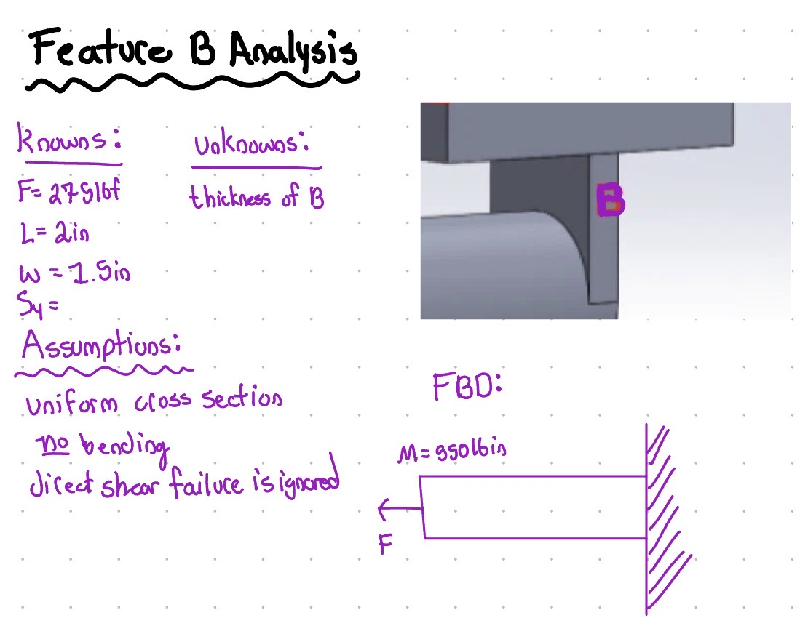

# A5 – Bracket Design

## Objective's:
**-** Conduct stress analysis to determine appropriate dimensions for structural features.

**-** Generate free body diagrams (FBDs) to visualize forces and constraints for each feature.\

**-** Identify and document known and unknown variables, assumptions, and algebraic models for stress calculations.

**-** Perform stiffness analysis to establish minimum required dimensions based on deflection constraints.

**-** Compare stress and stiffness analyses to ensure structural integrity and compliance with given constraints.

**-** Create detailed multiview sketches illustrating dimensions derived from both stress and stiffness analyses.

**-** Reflect on and document key engineering lessons learned throughout the process.

## Initial Design

For this Assignmet, I was tasked with creating a mounting bracket for this piece. 
There were some basic guidelines to follow with the dimensioning, as well as some choices made up to me about this assingment. 
**Design Load:** My chosen force is 550lbf, so my p=f/2 value would be 275lbf. 

**Safety Factor:** 4

**Max Deflection:** 0.005 in.

*Assume no failure due to direct shear stress!* - for designing... 

## Material Choice
For this assignment I am choosing to use ASTM A36 Steel. There was no particular reason I picked this material at all. 
Some important information about the A36 I will use later on:
**E(Elastic Modulus)** = 29,000,000 Psi

**σy(Yield Strenght)** = 36,000 Psi

**σ_allowble** = Yield Stenght Divided by the Safety Facotr (4)... this comes out to be 9,000 Psi

## Feature A
### Initial Information:
I started by listing my knowns and unknowns. This has become a routine step in ALL of my assignments. This helps keep everything organized and easy to follow along with. 

### A-Stress & Stiffness Analysis
After I gathered all of my information I calculated a stress and stiffness analysis on feature A using all of my previous information gathered. 

### A-Conclusion
After solving both algebraically and numerically, I found that the stress value was larger than the stiffness value so we could go with that one. From there I made the decision to round up to 1in. for my nominal dimension. Using the calculated dimension I double checked my work to make sure the value would withstand my requirments.

## Feature B
### Initial Information:

### B-Stress & Stiffness Analysis

### B-Conclusion

## Feature C
### Initial Information: 

### C-Stress & Stiffness Analysis

### C-Conclusion

## Feature D
### Initial Information:

### D-Stress & Stiffness Analysis

### D-Conclusion

## Feature E
### Initial Information:

### E-Stress & Stiffness Analysis

### E-Conclusion

## Lessons Learned
### Governing Failure Mode:
### Error propagaation:
### Assumption Sensativity:

## 2157 Students Only
