# A6 – Bracket Drawing [Drawings part 1]

## Objective
As part of this assignment, you will need to generate a comprehensive solid model and a multi-view engineering drawing that accurately represents your designed bracket, incorporating all features to ensure both strength and stiffness requirements are met.

## 1. Parametric Design 

### Equation List 
To start this assignment, I took the dimensions I calculated from A5 and used the *STRESS* Values. I also made a note in A5 where I would round up, I also implemented those into the equation list. 
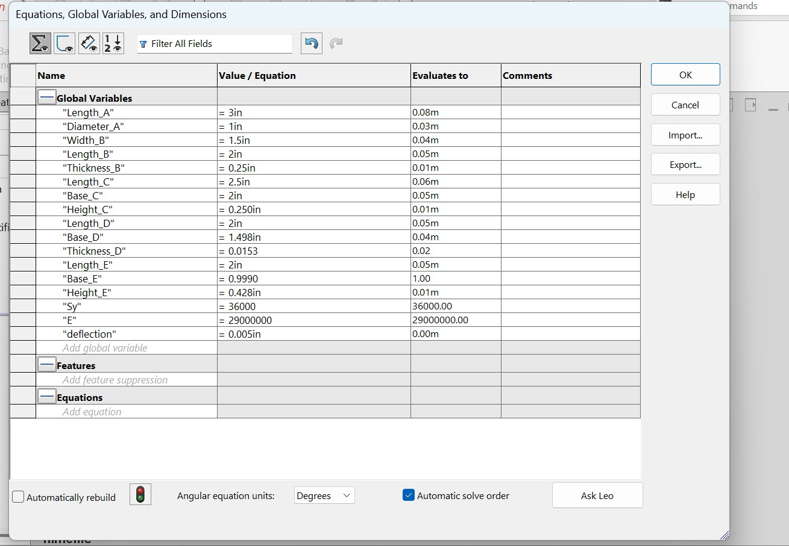

## 2. Starting the CAD 

### A.) 
For the initial CAD I started with feature A and built upon that. For my dimensions I made sure to apply my parametric values to the correct places.
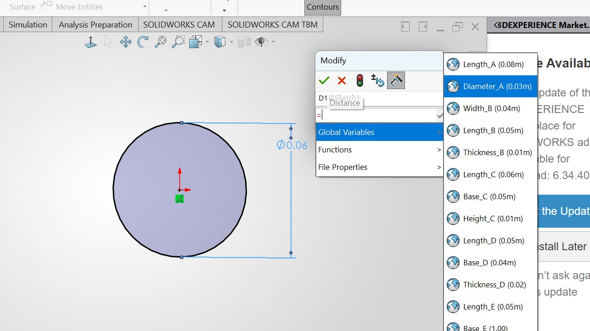

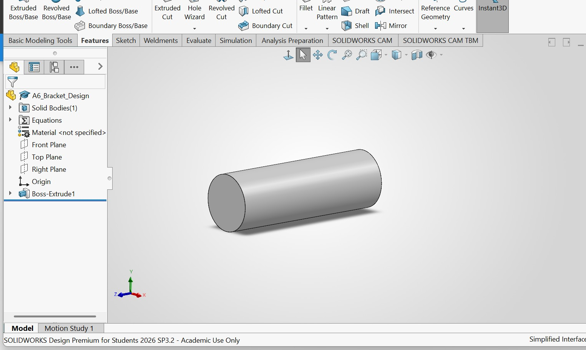

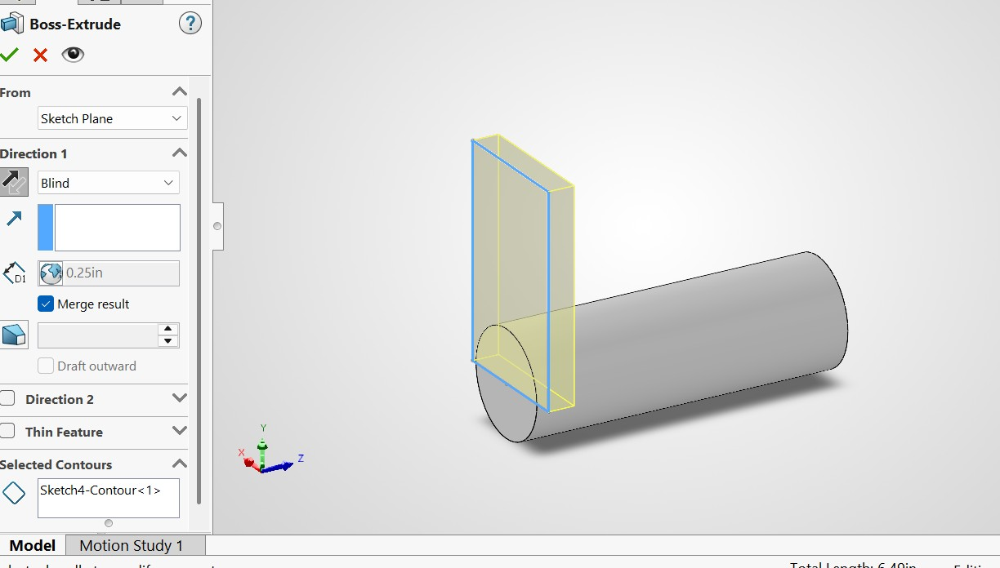

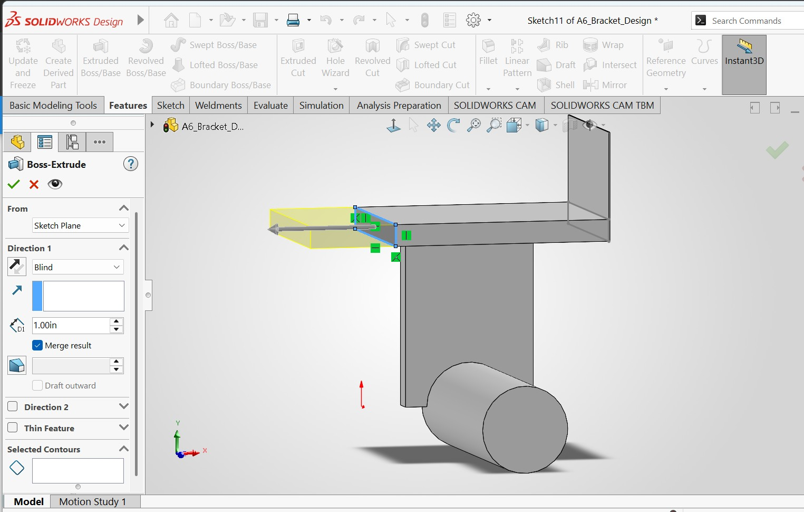

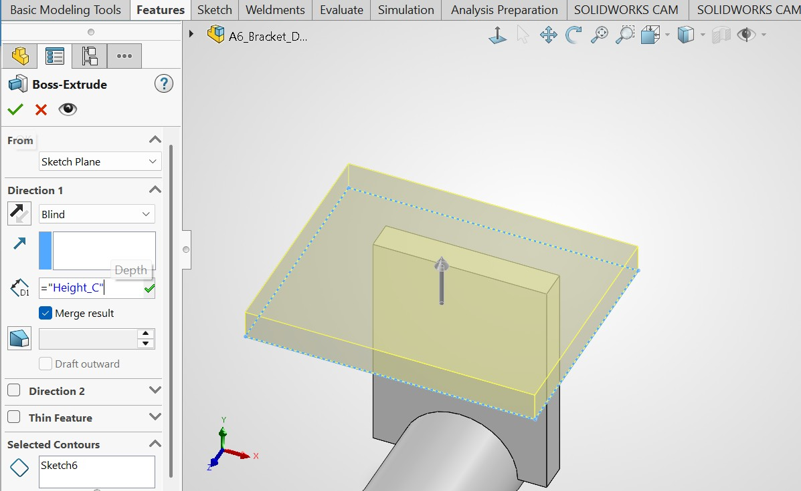

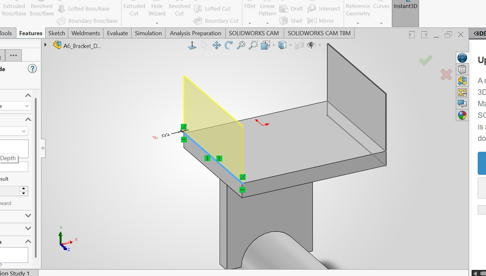

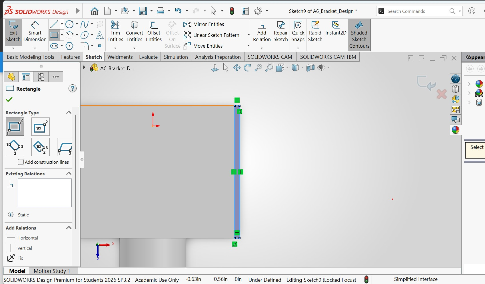

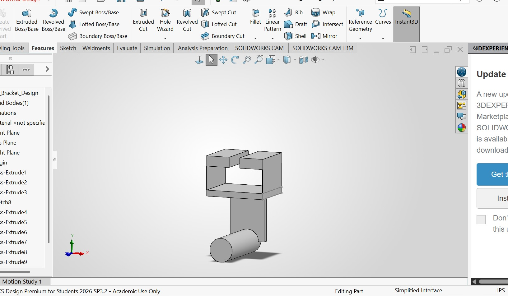

**To check my work, I used the smart dimension tool to double check all of my values before I started to generate the drawing!**

### Generating the Drawing

For this drawing I used the ASNI A version...I added my projected views in a 3rd angle format. 

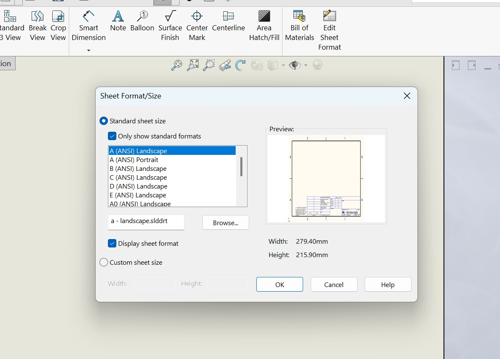

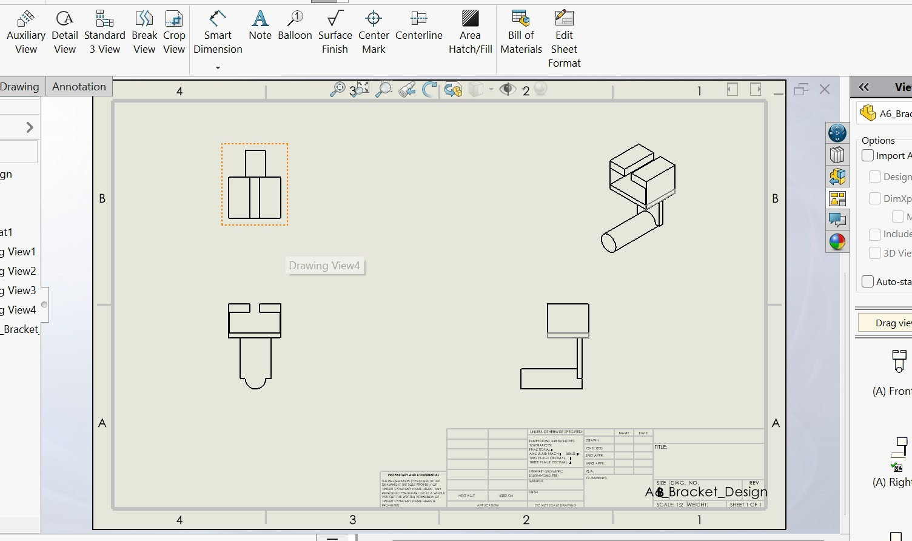

Once these are finished I decided to add my dimensions in. I paid close attention, especially after being shown some difficult to read drawings. I made sure I chose dimensions I could place on there and be able to hand to many different machinist and they could all manufacture the part. 

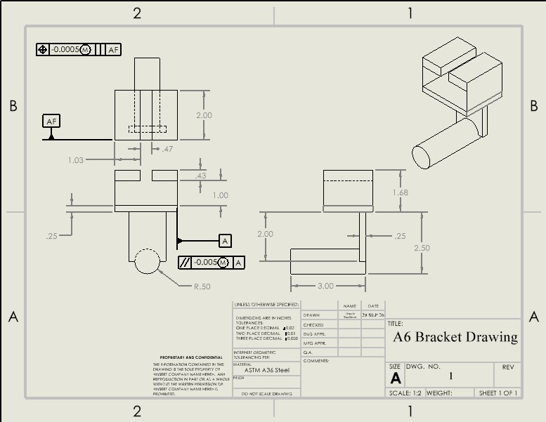
### B.) and C.)
#### About the projection 
For this assignment I used the ANSI 3rd angle projection view, this falls under the ASME Y14.3 standard. I added the symbol as shown into my title block. I also triple checked that it was correct! 

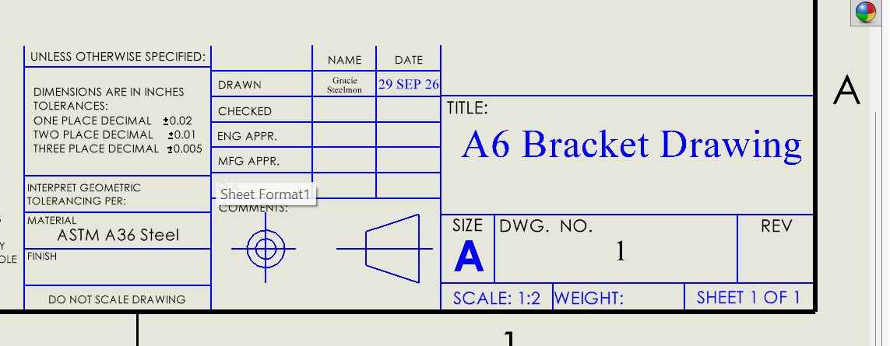

#### Tolerances
For the tolerance block I added the required tolerances from the assignment.
X.X ± .02
X.XX ± .01
X.XXX ± .005

#### GD&T
For this assignment we were asked to point out two callouts. For Datum "A" I chose the feature to be parallel to the one across from it. This is important as to the fit referenced from A5 assignment. This was specified to be accurate location and minimum play is desired. I added the tolerance band and an MMC modifier. This is important because it tells you that this dimension is the mx amount of material allowed in the tolerance. This is my first time implementing GD&T so I'm not extremely sure if that is correct. For datum "AF" I chose the block that secures the sliding piece into it. This is important for the piece that goes between both of those pieces. 

## 3. Reflections
### A.)
I used the stiffness equations to drive my A dimension for the rest of my modeling. This controls the diameter of part A. In the CAD modeling I expressed this as a radius on the front view. I tied this parameter to the Diameter of A in my parametric equations. 
### B.)
**Tighter Tolerance** - For this I picked datum A to have a tighter tolerance because from A5 it says minimum play is desired. 
**Looser Tolerance** - For this I picked the datum AF. I want this to have play so you can slide the bracket on and off as desired for whatever use. 

I spent an estimated 4 hours on this assignment. This one did not take as long since I already had my hand calculated values. I learned the importance of a title block and projections. I surprisingly never knew those before, but have always seen them. 

## 2157 - Students Only

### Parametric Equations

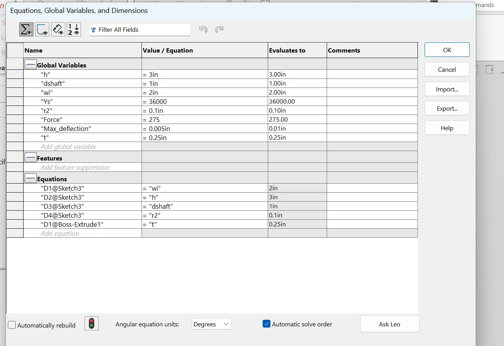

### CAD
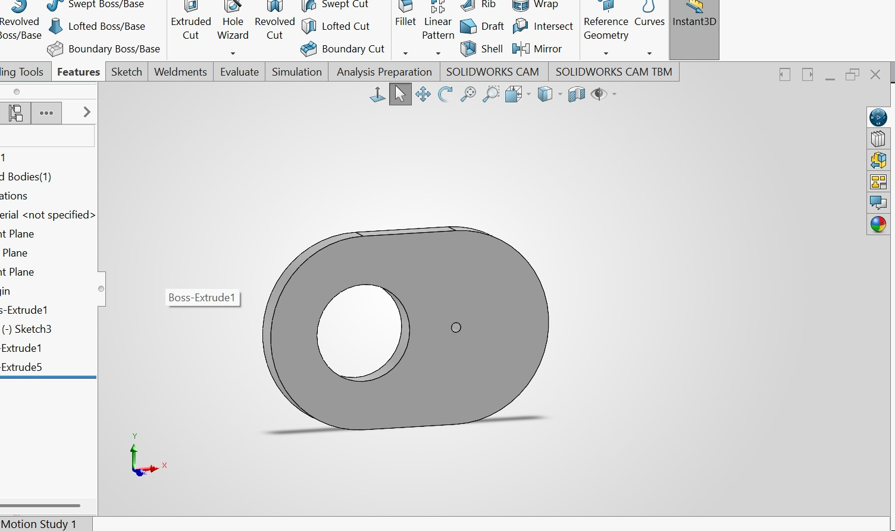

### Drawing

***For the callouts** I accidentally did this for the main assignment instead, so it will be in the previous section:)
This was also made from stress values!

## CAD Links
[A6 Bracket](A6_Bracket_Design.SLDPRT)
[A6 Bracket DRAWING](A6_Bracket_Design_FINAL.SLDDRW)
[Fit CAD](Fits.SLDPRT)
[Fit Drawing](Fits_Drawing.SLDDRW)
